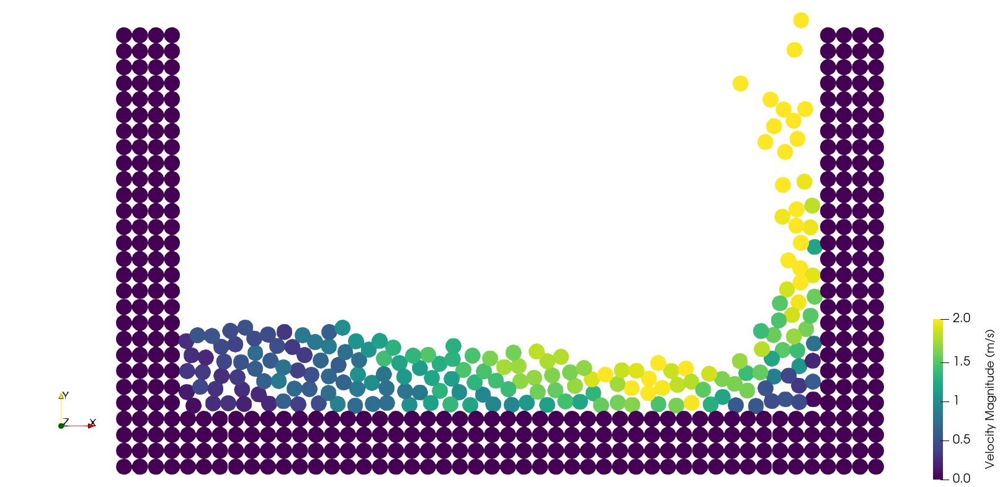

# MPS-Fluid-Simulation
Basic fluid simulator of weakly-compressible moving particle semi-implicit (MPS) in Python.
The code is very simply, altought extremely slow, to make it a good starting point to anyone who want to learn the basics of the MPS.

[2D dam-break simulation](https://youtu.be/yUgjYa51v6k) (in Portuguese)


## Module dependencies
- [NumPy](https://numpy.org/install)
- [scikit-learn](https://scikit-learn.org/stable/install.html)
- [tqdm](https://tqdm.github.io/)
- [pyvista](https://docs.pyvista.org/version/stable/getting-started/index.html)

## Run
In the command prompt (terminal)
```bash
py mps_explicit.py
```

## Output
This code writes vtk files as output. You can visualize them by open with [Paraview](https://www.paraview.org) :eyes:.

## Acknowledgments
Code largely inspired by:

https://www.youtube.com/watch?v=-0m05gzk8nk

https://doi.org/10.1016/C2016-0-03952-9
